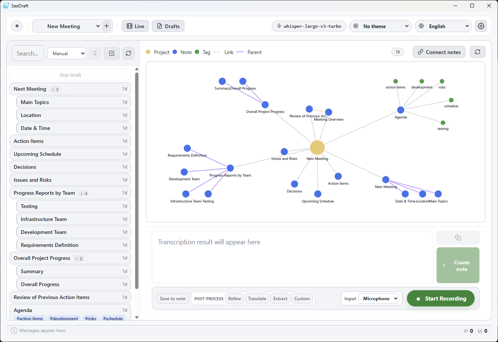

<p align="center">
    
</p>
<p align="center">Local-first, privacy-friendly voice-to-text for Windows.</p>
<p align="center">Record, transcribe, refine, translate, connect, and draft with on-device AI.</p>

# SeeDraft

**Languages:** **English** | [日本語](README.ja.md)

---

[](https://github.com/densenkouji/SeeDraft)

## Overview

SeeDraft is a Windows desktop application that turns speech and audio files into editable, connected notes without sending your data to the cloud. It combines:

- **Whisper speech-to-text** through Foundry Local
- **Local LLM post-processing** for refinement, translation, extraction, completion, and draft composition
- **SQLite-backed projects, notes, tags, note links, drafts, translations, and live-caption sessions**
- **Tauri 2 desktop integration** with an axum 0.8 local HTTP server

No API keys are required for SeeDraft itself. During development, model execution is provided by a sibling Foundry Local SDK checkout.

## Features

### Recording And Transcription

- Record from the microphone, capture PC playback audio, drag and drop audio files, or use press-and-hold dictation from anywhere on Windows.
- Supported file extensions include `wav`, `mp3`, `m4a`, `mp4`, `webm`, `ogg`, `flac`, `aac`, and `opus`.
- Choose a Whisper speech model from the Models tab. The default is `whisper-small`.
- Add a transcription prompt with meeting topics, speaker names, terminology, or spelling rules.
- Track model downloads with Server-Sent Events, including progress, failure diagnostics, variant details, and runtime compatibility.
- Warm up the selected speech model after startup so the first transcription request avoids the model-load cost.
- Normalize uploaded audio on the backend with Symphonia when needed; microphone recordings are converted in the browser to WAV, and PC playback audio is captured through Windows WASAPI loopback.

### Post-Processing Pipeline

- Run post-processing after transcription with quick toggles: save to note, refine, translate, extract, and custom steps.
- **Refine** conservatively fixes transcription artifacts while preserving meaning: fillers, obvious misrecognitions, punctuation, and spoken commands such as `new line`, `period`, `改行`, and `句点`.
- **Translate** source or refined text with optional terminology, target language, and custom translation instructions.
- **Extract** returns tone, summary, and keywords from text.
- **Complete** continues a note in the editor while keeping the existing language and style.
- **Custom steps** run ordered LLM instructions, with presets for polite tone, business memo, meeting minutes, casual rewrite, short summaries, and bullet organization.
- Linked-note context can be injected into refinement, translation, extraction, completion, and custom steps.

### Notes, Graph, And Drafts

- Organize notes by project with persistent SQLite storage.
- Search, edit, delete, reorder, tag, and nest notes with parent-child relationships.
- Connect notes manually in the graph view; linked notes can become LLM context.
- View a project graph containing project, note, tag, manual-link, and parent-child edges.
- Select notes and compose a draft by simple concatenation or by LLM rewrite into a single article.
- Edit, save, delete, and export drafts as Markdown.

### Live Captions

- Start a live-caption session from the top bar or a shortcut.
- Buffer microphone or PC playback audio continuously and transcribe utterances after pauses.
- Optionally translate live captions while the session is running.
- Save, rename, view, and delete live-caption sessions.

### Desktop And Daily Use

- System tray support: closing the main window hides it; the tray menu can show or quit the app.
- Configurable shortcuts for show app, open live captions, toggle recording, open settings, close, and quit.
- Global press-and-hold recording defaults to `RightCtrl`; results can be copied to the clipboard or inserted at the cursor.
- Light, dark, or system theme.
- Japanese and English UI. Locale JSON files are seeded on first launch, can be edited, and extra `*.json` locale files can be added.
- Persistent settings for project, speech model, language, microphone, quick toggles, custom steps, post-processing models, theme, locale path, output folder, output filename prefix, and shortcuts.
- Toasts for normal feedback and a persistent error banner for serious failures.

## Architecture

```
┌────────────────────────────────────────────────────────┐
│ Tauri 2 WebViews                                      │
│ Main UI and hold-recording overlay served by axum      │
└──────────────────────────┬─────────────────────────────┘
                           │ HTTP on 127.0.0.1
┌──────────────────────────▼─────────────────────────────┐
│ axum 0.8 server                                        │
│  ├─ /, /index, /hold-overlay, /assets/icon.ico         │
│  ├─ /api/transcribe                 Whisper STT        │
│  ├─ /api/process                    pipeline steps     │
│  ├─ /api/refine, /api/translate     single-step LLM    │
│  ├─ /api/analyze, /api/complete     extract/complete   │
│  ├─ /api/system-audio/*             WASAPI loopback    │
│  ├─ /api/models/*, /api/download/*  model management   │
│  ├─ /api/app/*, /api/locales        app settings       │
│  ├─ /api/projects, /api/notes       SQLite notes       │
│  ├─ /api/note-links, /api/graph     graph relations    │
│  ├─ /api/drafts                     draft workspace    │
│  ├─ /api/translations               translation history│
│  └─ /api/live/*                     live captions      │
└──────────────────────────┬─────────────────────────────┘
                           │
┌──────────────────────────▼─────────────────────────────┐
│ foundry-local-sdk                                      │
│ ONNX Runtime GenAI / WinML on Windows                  │
└────────────────────────────────────────────────────────┘
```

- Desktop mode starts the axum server in the Tauri `setup` hook, waits for a successful bind, then opens the main WebView.
- The preferred loopback port is `127.0.0.1:38713`; if unavailable, the app falls back to an OS-assigned port.
- Server-only mode binds to the address passed with `-s`; when only a host is provided, it uses port `8000`.
- The main window uses `http://127.0.0.1:<port>/index`; the transparent hold-recording overlay uses `/hold-overlay`.
- User data is stored in the OS data directory as `seedraft.sqlite` and `settings.json`.
- Default locale files are seeded to a `locales/` directory beside the executable, or to the app data directory if the executable path is unavailable. The locale directory can be changed in settings.
- Temporary uploaded audio is written under the system temp directory in `seedraft-voice-to-text/`.

## Requirements

- Windows 11 x64
- Rust toolchain, edition 2024
- Microsoft C++ Build Tools / MSVC
- Foundry Local SDK checked out as a sibling directory at `../Foundry-Local/sdk/rust`
- Tauri CLI for installer builds

Packaged installers bundle the Foundry Local native runtime staged from the SDK build output, so end-user PCs do not need a separate Foundry Local app or CLI installation.

## Getting Started

### 1. Install Rust

Install Rust with `rustup`, then confirm the toolchain:

```powershell
rustc --version
cargo --version
```

### 2. Install Tauri CLI

```powershell
cargo install tauri-cli --version "^2.0.0" --locked
cargo tauri --version
```

### 3. Clone With Foundry Local As A Sibling

```powershell
git clone https://github.com/microsoft/Foundry-Local
git clone https://github.com/densenkouji/SeeDraft.git
cd SeeDraft
```

Expected layout:

```
/
├─ Foundry-Local/
│  └─ sdk/rust/
└─ SeeDraft/
   └─ Cargo.toml
```

### 4. Run

```powershell
# Desktop application
cargo run

# Server-only mode for browser debugging
cargo run -- -s 127.0.0.1:38713
```

On first use, SeeDraft checks whether at least one compatible speech model and one compatible text-processing model are already downloaded. If either category is missing, it offers to download the default model for that category (`whisper-small` for speech, `qwen2.5-coder-0.5b` for text processing). SeeDraft uses Foundry Local's default model cache location and does not override it.

### 5. Build Installers

```powershell
cargo tauri build
```

Installer artifacts are written under `target/release/bundle/`. During the build, SeeDraft stages the required Foundry Local native binaries into `native/foundry-local/win-x64` and bundles them as the Tauri `foundry-local` resource. The staged DLLs are ignored by Git. The default bundle target is the NSIS `.exe` installer.

## Usage Cheatsheet

| Action | Where |
|---|---|
| Start / stop recording | Record button at the bottom, or shortcut |
| Switch input source | Input selector beside the record button |
| Press-and-hold dictation | Default global shortcut: `RightCtrl` |
| Transcribe an audio file | Drag and drop onto the app window |
| Save current text as a note | `Save as note` / `ノートに追加` button |
| Auto-run post-processing | Quick toggles beside the record button |
| Change, download, delete, or test models | Settings -> Models |
| Add terminology or transcription hints | Settings -> Transcription |
| Configure refine, translation, custom steps, linked context, extraction, completion | Settings -> Post-processing |
| Set output folder / filename prefix | Settings -> Output |
| Configure shortcuts and hold-recording output | Settings -> Shortcuts |
| Search and organize notes | Left notes sidebar |
| Link notes visually | Graph toolbar -> Connect notes |
| Compose a draft | Select notes -> Compose draft |
| Use live captions | Top bar -> Live |
| Export a draft | Drafts workspace -> Export as Markdown |
| Restore or quit from tray | Windows notification area tray icon |

## Project Structure

```
/
├─ AGENTS.md               # Project context and coding workflow
├─ CLAUDE.md               # Claude-oriented project context
├─ Cargo.toml              # Rust dependencies
├─ Cargo.lock
├─ build.rs                # tauri_build::build()
├─ tauri.conf.json         # Tauri config (productName: SeeDraft)
├─ dist/
│  └─ index.html           # Tauri frontendDist placeholder
├─ src/
│  ├─ main.rs              # axum routes, API handlers, model service, app startup
│  ├─ desktop.rs           # Tauri tray, shortcuts, hold-recording overlay commands
│  ├─ settings.rs          # app settings, locale seeding, folder picker
│  ├─ storage.rs           # SQLite data layer and migrations
│  ├─ views.rs             # embedded HTML/icon route handlers
│  ├─ ui/
│  │  ├─ index.html        # main single-file frontend
│  │  └─ hold_overlay.html # transparent hold-recording overlay frontend
│  └─ locales/             # bundled ja/en locale JSON
├─ native/
│  └─ foundry-local/win-x64/
├─ res/
│  ├─ icon.ico
│  └─ app.rc
├─ icons/
│  └─ icon.png
├─ images/                 # README assets
└─ docs/                   # API, database, screen specs, changelog
```

## Data Model

SQLite tables are created and migrated by `src/storage.rs`:

- `projects`
- `notes`
- `tags`
- `note_tags`
- `note_links`
- `drafts`
- `draft_notes`
- `translations`
- `live_sessions`
- `live_segments`

## Key Design Decisions

- **Local HTTP app shell.** axum serves all HTML/API routes; Tauri displays the local URL and manages desktop-only integrations.
- **Readiness before WebView.** The Tauri window is created only after the HTTP server binds successfully.
- **Preferred port with fallback.** The app tries `38713` first, then falls back to an ephemeral loopback port.
- **Separate overlay WebView.** Press-and-hold dictation uses a transparent, click-through Tauri window positioned near the cursor.
- **Tray-first close behavior.** Closing the main window hides it; quitting through the tray or command path performs graceful shutdown.
- **Model cache and warmup.** Speech and chat models are cached in memory; the selected speech model is warmed up at startup and unloaded during shutdown.
- **SSE download progress.** Model download events are broadcast to the UI via `/api/download/events`.
- **Structured local storage.** Projects, notes, links, drafts, translations, and live sessions are persisted in SQLite with additive migrations.
- **Meaning-preserving refinement.** Built-in refinement is intentionally conservative; stylistic rewrites are handled by custom post-processing steps.
- **Graceful model shutdown.** Cached Foundry Local models are explicitly unloaded before the process exits.

## Roadmap

- [ ] More robust live streaming transcription
- [ ] Automated release workflow and signing
- [ ] macOS / Linux support when the local runtime stack allows it

## Privacy

See [Privacy Policy](docs/legal/privacy-policy.md).

## License

MIT

## Acknowledgements

- [Microsoft Foundry Local](https://github.com/microsoft/Foundry-Local) - on-device model runtime
- [Tauri](https://tauri.app/) - desktop shell
- [axum](https://github.com/tokio-rs/axum) - HTTP server
- [symphonia](https://github.com/pdeljanov/Symphonia) - audio decoding
- [rusqlite](https://github.com/rusqlite/rusqlite) - SQLite binding
